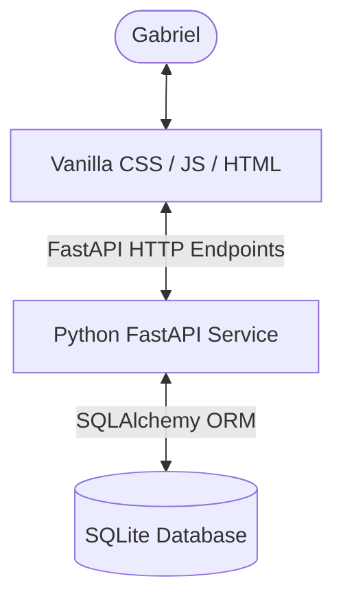

## Overview

This skill contains the comprehensive developer memory, architectural patterns, database schemas, and UX design decisions for Gabriel's self-hosted, RPG-style **Habit Tracker**. 

Whenever you need to make changes, modify features, or debug the habit tracker, you **MUST** read this skill file first to align with established patterns.

---

## 1. Project Architecture

The application is split into a robust, fast backend API service and an interactive, glassmorphic frontend application.



### Key Files
- **Backend Directory**: `/backend`
  - [models.py](file:///home/gabriel/Desktop/CS%20and%20programation/01-projets-actifs/habit-tracker/backend/src/database/models.py): Declares database tables and SQLAlchemy schemas.
  - [routes.py](file:///home/gabriel/Desktop/CS%20and%20programation/01-projets-actifs/habit-tracker/backend/src/api/routes.py): Handles REST API endpoints and Pydantic validation schemas.
  - [seed.py](file:///home/gabriel/Desktop/CS%20and%20programation/01-projets-actifs/habit-tracker/backend/src/database/seed.py): Seeds database structures on startup.
- **Frontend Directory**: `/frontend`
  - [index.html](file:///home/gabriel/Desktop/CS%20and%20programation/01-projets-actifs/habit-tracker/frontend/index.html): Houses layouts, glassmorphic styles, and DOM node structures.
  - [app.js](file:///home/gabriel/Desktop/CS%20and%20programation/01-projets-actifs/habit-tracker/frontend/js/app.js): Handles state, routing, visual DAG skill-tree column renders, and network fetches.
  - [style.css](file:///home/gabriel/Desktop/CS%20and%20programation/01-projets-actifs/habit-tracker/frontend/css/style.css): Main stylesheet with primary HSL colors and dashboard widgets.

---

## 2. Database Models & Schema

The core relational structure is defined using SQLAlchemy. The relationships allow a structured progression of substeps under goals, grouped by their execution order.

### 1. `Goal`
Represents high-level player objectives.
- `id` (Integer, Primary Key)
- `title` (String, Required)
- `description` (Text, Optional)
- `completed` (Boolean, default: `False`)

### 2. `SubStep`
Represents tasks or stages necessary to accomplish a goal.
- `id` (Integer, Primary Key)
- `title` (String, Required)
- `description` (Text, Optional)
- `gold_reward` (Integer, default: `150`)
- `stats` (JSON List of stats impacted, e.g. `["finance", "discipline"]`)
- `execution_order` (Integer, default: `1`)
- `completed` (Boolean, default: `False`)


### 3. `SubStepGoalLink`
Maps many-to-many linkages so steps can belong to multiple goal trees.
- `goal_id` (Integer, Foreign Key)
- `substep_id` (Integer, Foreign Key)

### 4. `Habit`
Represents character habits and scheduled check-ins.
- `id` (Integer, Primary Key)
- `user_id` (Integer, Foreign Key)
- `name` (String, Required)
- `type` (String, "binary" or "quantitative")
- `frequency` (String, default: "daily")
- `scheduled_days` (String, default: "0,1,2,3,4,5,6")
- `is_active` (Boolean, default: `True`)
- `deactivated_at` (DateTime, Optional)
- `created_at` (DateTime, default: `datetime.now`)

### 5. `User`
Represents character profile and pinned goals/softskills.
- `id` (Integer, Primary Key)
- `username` (String)
- `level` (Integer, default: `1`)
- `xp` (Integer, default: `0`)
- `gold` (Integer, default: `0`)
- `pinned_substeps` (TEXT, serialized JSON list of integers)
- `pinned_softskills` (TEXT, serialized JSON list of strings)

---

## 3. Backend Endpoints

### Profile & Pins
- `GET /api/v1/profile` — Retrieves active player statistics and pinned lists.
- `PUT /api/v1/profile/pins` — Saves user's pinned sub-step and softskill IDs (max 3 per category).

### Goals
- `GET /api/v1/goals` — Retrieves all goals with resolved substeps and completeness percentages.
- `POST /api/v1/goals` — Creates a new goal.
- `PUT /api/v1/goals/{id}` — Updates a goal's title and description.
- `DELETE /api/v1/goals/{id}` — Cascade deletes a goal and its associated linkages.

### Substeps
- `POST /api/v1/goals/{goal_id}/substeps` — Creates a substep within a goal.
- `PUT /api/v1/substeps/{substep_id}` — Updates title, description, gold reward, target stats, and execution order.
- `DELETE /api/v1/substeps/{substep_id}` — Deletes a substep.
- `POST /api/v1/substeps/{substep_id}/complete` — Marks substep as complete, rewards the player gold, updates character stats, and flags the parent goal as complete if all substeps are satisfied.

### Habits & Streaks
- `GET /api/v1/habits` — Retrieves all habits.
- `POST /api/v1/habits` — Creates a new habit.
- `PUT /api/v1/habits/{id}` — Updates a habit (handles deactivation/reactivation state and streak freeze resets).
- `DELETE /api/v1/habits/{id}` — Soft-deactivates a habit and sets `deactivated_at`.
- `GET /api/v1/habits/{id}/calendar` — Retrieves monthly streak data and status calendar grid.

---

## 4. Frontend & Layout Conventions

### 3-3-3 Recap Dashboard Panel
- **Vertical Stack**: Placed on the main page above the character sheet, displaying sections vertically (`display: flex; flex-direction: column;`).
- **Focus Node Animation**: Clicking a pinned item focuses on its node (redirecting to the respective tab and animating with `pulse-highlight` keyframes).
- **Selection Constraints**: Selection checkboxes in `#recap-pin-drawer` are limited to 3 items max.

### Slide-Out Drawer vs Centered Modal Popup
1. **Creation View**: Clicking `⚔️ Forger & Gérer` slides a large panel out from the right (`right: 0`) showing all form sections.
2. **Editing View**: Clicking the `✏️` button on a Goal or Substep centers the panel as a beautiful centered popup modal.
   - Class: `.creators-drawer.modal-popup`
   - Transition: Satisfying spring-scale animation using `transform: translate(-50%, -50%) scale(1);` with `cubic-bezier(0.34, 1.56, 0.64, 1)`.

### Responsiveness Rules
- The drawer uses responsive constraints: `width: 100%; max-width: 420px; right: -100%;` to slide cleanly on mobile viewports.
- The modal popup uses responsive sizing: `width: 95% !important; max-width: 550px !important;` to render wide and spacious on desktop, while scaling down cleanly to fit mobile portrait layouts without horizontal clipping.
- Padding inside popup: `1.5rem 1.2rem` to maximize input spaces.

### Skill Tree Rendering (execution_order)
The visual representation of goals and substeps in `app.js` groups items horizontally by `execution_order`. 
- Columns are generated dynamically based on unique `execution_order` values.
- Within a column, substeps are stacked vertically.
- The parent Goal node is displayed as the final step in its own dedicated column to visually symbolize the culmination of the journey.

### Dynamic Card Visibility
In `app.js`, `openDrawer(mode, ...)` handles toggling specific form cards to prevent UI clutter:
- **`mode === "add-goal"`**: Displays only `#edit-goal-section` to create a new goal.
- **`mode === "add-substep"`**: Displays only `#create-substep-section` to quickly add a new substep.
- **`mode === "links"`**: Displays only `#links-blockers-section` to handle advanced goal linkages.
- **`mode === "edit"`**: Displays only `#edit-goal-section` populated with existing goal data.
- **`mode === "edit-substep"`**: Displays only `#edit-substep-section` populated with existing substep data.

### Habit Detail Drawer & Calendar
- **Interactive Habit View**: Clicking on a habit card slides out the `#habit-detail-drawer` containing badges for current and max streak plus a monthly interactive calendar grid (`#habit-detail-calendar-grid`). Stat reward badges were removed with the RPG stat system.
- **Calendar Color Codes**: Days are visually distinct based on state classes (`completed`, `skipped`, `missed`, `non-scheduled`, `pre-creation`). Tooltips are rendered dynamically on hover to show the detailed state name.
- **Deactivation/Reactivation Toggle**: A button inside the drawer allows users to soft-delete (deactivate) or reactivate habits, applying confirmation alerts and calling the soft-delete/update API routes.

---

## 5. Development & Testing Commands

To verify backend schema changes, API endpoints, or database structures:
- Run Pytest from the backend directory using the project's virtualenv:
  ```bash
  PYTHONPATH=backend .venv/bin/pytest backend/tests
  ```
- All endpoints, daily scores, and user isolation schemas should remain 100% green.
