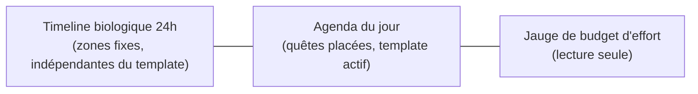

# Agenda vertical & timeline biologique

Tu sais qu'il y a des heures de la journée où tu es plus efficace pour réfléchir, et d'autres plus propices à te dépenser physiquement. Ici, ce rythme personnel porte un nom : la **timeline biologique**. Elle sert de repère fixe pour placer tes [quêtes](#/habitudes) au bon moment de la journée.

## Trois zones, un seul écran

La vue « Perfect Day » du dashboard affiche trois blocs côte à côte :

- **La timeline biologique** (en haut) ne bouge pas d'un jour à l'autre : c'est ta référence perso, configurée une fois dans Réglages → « Journée biologique ».
- **L'agenda du jour** (à gauche) montre les [quêtes](#/habitudes) que tu as placées dans des créneaux, selon le [template de jour](#/templates-de-jour) actif.
- **La jauge d'effort** (à droite) résume combien d'heures de chaque type d'effort sont déjà planifiées, en lecture seule.

## La timeline biologique (zones)

Une zone biologique a un nom, un type (`deep_focus` 🧠, `physical_peak` 💪, `creative` 🎨, `rest` 🧘, `social` 🧡, `sleep` 😴), une heure de début et de fin (`HH:MM`), et un ordre d'affichage. Les zones seedées par défaut à l'installation :

| Zone | Type | Horaire |
|---|---|---|
| Sommeil | `sleep` | 23:00 → 07:00 |
| Focus Profond Matin | `deep_focus` | 08:00 → 12:00 |
| Repos / Déjeuner | `rest` | 12:00 → 13:00 |
| Pic Physique | `physical_peak` | 14:00 → 17:00 |
| Zone Créative | `creative` | 20:00 → 22:00 |

Tu peux les modifier dans Réglages (`GET`/`POST`/`PUT`/`DELETE /api/v1/biological-zones`). Deux garde-fous : le système refuse (erreur 422) deux zones qui se chevauchent, et il gère correctement une zone qui traverse minuit (comme le Sommeil, dont l'heure de fin est plus petite que l'heure de début).

## Placer une quête dans l'agenda

Une quête placée occupe un créneau précis du jour : heure de début, durée en minutes, et un statut (`planned` par défaut). Tu la places ou la retires via `PUT` / `DELETE /api/v1/agenda/{date}/quests/{habit_id}/placement`. `GET /api/v1/agenda` renvoie l'agenda complet du jour (zones + placements + budgets). Une fois content d'une disposition, `POST /api/v1/agenda/{date}/save-as-template` la sauvegarde pour la réutiliser.

Le système laisse toujours un **tampon de 15 minutes** entre deux blocs placés — pas de créneaux collés bord à bord.

## Le budget d'effort, plafonné par template

Chaque [quête](#/habitudes) a un type d'effort : `musculaire`, `cerveau`, `emotionnel_social`, `creatif_divergent`, ou `repos`. Le [template de jour](#/templates-de-jour) actif fixe combien d'heures de chaque type tu peux raisonnablement planifier :

| Template | Plafond par type (sauf repos) | Plafond total | Focus par défaut | Repos min. par défaut |
|---|---|---|---|---|
| `rest` | 1,0 h | 4,0 h | 2 h | 10 h |
| `regular` | 2,0 h | 8,0 h | 6 h | 8 h |
| `hustle` | 4,0 h | 10,0 h | 9 h | 7 h |

Ces plafonds évitent de te sur-planifier un jour `rest`, ou de te sous-planifier un jour `hustle`. Si le repos planifié tombe sous le minimum du template, l'agenda te le signale.

Envie de voir cette journée type sur ton téléphone plutôt que sur le dashboard ? Le bouton d'export pousse les quêtes placées vers [Google Calendar](#/sync-google).

## Le cycle hebdomadaire hustle / repos

Le système ne te laisse pas enchaîner les jours `hustle` indéfiniment : une politique de cycle, par tranche de **4 semaines**, recommande un dosage :

- **Semaine normale** (3 semaines sur 4) : 2 à 3 jours `hustle`, 1 jour `rest`.
- **Semaine chill** (1 semaine sur 4) : 1 à 2 jours `hustle`, 2 jours `rest`.

La bascule est automatique : le système calcule le nombre de semaines écoulées depuis ton installation et détermine si la semaine en cours est « normale » ou « chill ». C'est une recommandation affichée, pas une limite bloquante — tu choisis toujours librement ton [template](#/templates-de-jour) du jour.
