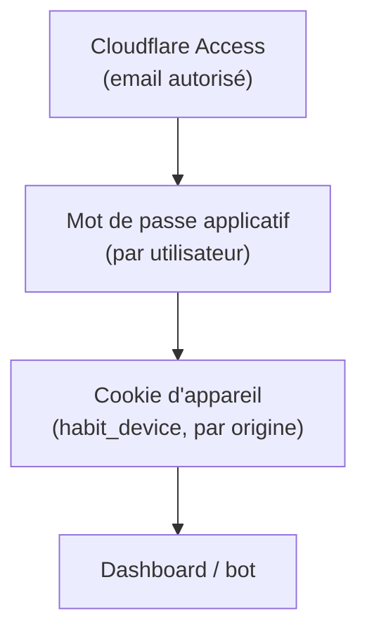

# Authentification & appareils

Tu connais le principe d'un mot de passe pour te connecter à un site. Ici, il y a **trois couches** empilées avant d'accéder au dashboard, parce que le Pi tourne exposé sur Internet pour que le groupe y accède de n'importe où.

## Les trois couches

1. **Cloudflare Access**, en amont du serveur : seules les adresses email autorisées passent, avant même d'atteindre l'application.
2. **Mot de passe applicatif** : chaque joueur a son propre mot de passe, vérifié par l'API.
3. **Cookie d'appareil** (`habit_device`) : posé par navigateur/origine, pas par machine physique — si tu ouvres le dashboard depuis deux navigateurs différents sur le même téléphone, ce sont deux appareils distincts pour le système.

## Auto-approbation des appareils (comportement actuel)

> [!note] Depuis le 2026-07-02, **tout nouvel appareil est auto-approuvé**. L'écran d'approbation/révocation manuelle a été retiré du dashboard pour éviter qu'un joueur se retrouve enfermé dehors (auto-lockout) faute d'un admin disponible pour l'approuver.

Concrètement, `POST /auth/devices/request` crée toujours l'appareil avec le statut `approved` directement — il n'y a plus d'étape « en attente ». Les endpoints `POST /auth/devices/{id}/approve` et `POST /auth/devices/{id}/revoke` existent encore côté API (réservés à un admin) mais ne sont plus utilisés par une UX dédiée dans le dashboard.

## Bootstrap : créer le premier mot de passe admin

Avant toute connexion, il faut un premier compte admin. `AUTH_BOOTSTRAP_CODE` (variable d'environnement) est un code temporaire à usage unique : `POST /auth/bootstrap` le vérifie, fixe le mot de passe du premier utilisateur choisi et le passe admin. Une fois `AUTH_BOOTSTRAP_CODE` consommé (un admin existe), la route refuse tout nouveau bootstrap.

## Endpoints principaux

| Endpoint | Rôle |
|---|---|
| `GET /auth/status` | état courant : authentifié ou non, bootstrap requis ou non, appareil connu |
| `POST /auth/bootstrap` | crée le premier admin avec `AUTH_BOOTSTRAP_CODE` |
| `POST /auth/devices/request` | enregistre l'appareil courant (auto-approuvé) |
| `POST /auth/login` | vérifie utilisateur + mot de passe, ouvre une session |
| `POST /auth/logout` | révoque la session courante |
| `GET /auth/users` | liste des joueurs (appareil approuvé requis) |
| `GET /auth/devices` | liste des appareils connus (admin) |
| `POST /auth/devices/{id}/approve` / `/revoke` | encore actifs côté API, sans UX dédiée |
| `POST /auth/password` | change son propre mot de passe |
| `POST /auth/users/{id}/password` | un admin change le mot de passe d'un autre joueur |

## Sessions

Une session vit `AUTH_SESSION_DAYS` jours (30 par défaut), portée par un cookie signé. `AUTH_COOKIE_SECURE` doit rester à `true` uniquement si le site tourne en HTTPS — sinon le navigateur rejette le cookie.

## Accès machine (pas un navigateur)

Un agent ou un script qui appelle l'API directement — la [télécommande IA](#/telecommande-ia) par exemple — ne passe pas par le cookie d'appareil. Il envoie l'en-tête `Authorization: Bearer <HABIT_API_TOKEN>` : un jeton machine défini en variable d'environnement, séparé du mot de passe des joueurs. Le header `X-User-ID` reste nécessaire à côté pour dire **quel** joueur agit — `HABIT_API_TOKEN` prouve seulement que l'appelant a le droit d'appeler l'API sans navigateur.

## Mode legacy (sans authentification)

Si ni `AUTH_BOOTSTRAP_CODE` ni un compte admin ne sont configurés, le système tolère un mode non authentifié — pratique pour un usage strictement local (le Pi sur le réseau domestique, sans exposition Internet). Dès qu'un admin existe, ce mode legacy se ferme automatiquement.
