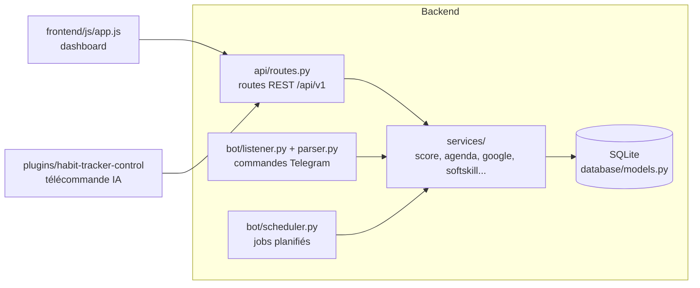

# Développer

Tu veux toucher le code, pas juste utiliser l'app. Cette page donne le plan du bâtiment — stack, dossiers, démarrage — sans reprendre ce qui est déjà documenté ailleurs.

## Stack

Deux services partagent une même base de données, un peu comme deux applications qui liraient et écriraient dans le même tableur : pas d'API interne entre eux, juste une base SQLite commune (`./data/` en local, `/data/` en Docker).

- **Backend** : FastAPI + SQLAlchemy 2.0, Python 3.12. Bot Telegram via `python-telegram-bot`, tâches planifiées via APScheduler (voir la table « Automatismes planifiés » de la [Carte de l'app](#/carte-de-l-app)).
- **Frontend** : HTML/CSS/JS vanilla, sans framework ni build, servi en statique par FastAPI.
- **Déploiement** : Docker Compose (`api` + `bot`) sur un Raspberry Pi 5, avec des limites mémoire serrées (40/35 Mo par service) — pas de place pour de grosses dépendances.

## Où vivent les choses



- **Logique métier** (scores, XP, streaks, agenda, softskills, synchro Google) : dans `backend/src/services/`, jamais dans les routes.
- **Schéma** : `backend/src/database/models.py`. Toute nouvelle colonne passe par une migration idempotente dans `database/seed.py` (`create_all()` ne modifie pas les tables existantes).
- **Commandes du bot** : `backend/src/bot/parser.py` ; l'index de référence tenu à jour à la main est `COMMANDS-INDEX.md` à la racine.
- **Identité utilisateur** : header `X-User-ID`, pas de session ni de JWT côté API (voir [Authentification](#/authentification) pour la couche web).

## Démarrer en local

```bash
uv venv && source .venv/bin/activate && uv pip install -r backend/requirements.txt

# Dashboard / API → http://localhost:5000
PYTHONPATH=backend python3 backend/src/main.py

# Bot Telegram
PYTHONPATH=backend python3 backend/src/bot/listener.py

# Tests
PYTHONPATH=backend .venv/bin/pytest backend/tests
```

En local, l'utilisateur par défaut est `gabriel` / mot de passe `admintest` — voir [Authentification & appareils](#/authentification) pour le mode production (Cloudflare Access + bootstrap).

## Référence pour tester

Pour le détail de chaque commande, variable d'environnement et interaction entre concepts : [Règles & variables](#/regles-et-variables). Pour vérifier qu'une fonction marche encore après une modification : la [Carte de l'app](#/carte-de-l-app), qui donne un test de 30 secondes par fonction et un parcours de validation complet.

## Piloter l'instance sans navigateur

Un agent IA peut consulter et modifier une instance distante via un plugin dédié (`plugins/habit-tracker-control`), en HTTP direct sur `/api/v1` — pas de MCP, pas d'accès SQLite direct. Voir [Télécommande IA](#/telecommande-ia).
