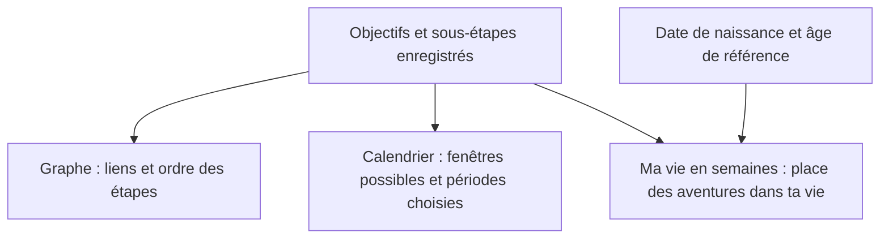

# Des objectifs aux perspectives

**« Objectifs & Graphes » contient tes projets et leurs étapes. « Perspectives » reprend ces mêmes données pour les montrer dans le temps.** Ce sont plusieurs lectures des mêmes informations.

**1. La data dans « Objectifs & Graphes »**

Le système enregistre trois choses principales :

| Donnée | Ce qu’elle représente | Exemple fictif |
|---|---|---|
| Objectif | Le résultat que tu veux atteindre | Vivre à l’étranger |
| Sous-étape | Une étape de ce projet | Passer six mois au Japon |
| Lien | L’appartenance d’une étape à un objectif, avec son ordre | Cette aventure contribue à « Vivre à l’étranger » |

Une sous-étape peut appartenir à plusieurs objectifs. Elle reste **une seule donnée partagée** : sa modification ou sa validation se retrouve partout.

Elle contient aussi son titre, sa description, son état de complétion, sa récompense et éventuellement son marqueur Life Lore.

**2. Les informations qui permettent de créer la perspective**

Sur une sous-étape, tu peux ajouter :

| Information | Exemple |
|---|---|
| Durée estimée | 6 mois |
| Début possible dès | Janvier 2027 |
| Fin au plus tard | Décembre 2029 |
| Début choisi, depuis le calendrier | Avril 2028 |

Ça signifie : « Cette aventure prend six mois. Elle doit tenir entièrement entre janvier 2027 et décembre 2029. Je choisis finalement avril à septembre 2028. »

La **fenêtre possible** exprime ta marge de manœuvre. La **période choisie** exprime ta décision.

**3. Comment ça devient les deux vues de « Perspectives »**

Dans le **Calendrier des objectifs**, la fenêtre possible devient une barre pâle, et la période choisie devient une barre vive. Les périodes choisies qui se chevauchent sont signalées en ambre. Tu peux ainsi voir quels projets se retrouvent au même moment.

Dans **Ma vie en semaines**, chaque case représente une semaine entre ta naissance et l’âge de référence choisi. L’application :

- place d’abord les périodes que tu as choisies ;
- cherche ensuite une place libre pour les autres aventures configurées, en commençant par celles dont la fenêtre ferme le plus tôt ;
- garde visibles celles pour lesquelles elle ne trouve pas de place.

Les suggestions automatiques restent illustratives. Seul un choix explicite dans le calendrier enregistre une période. La date de naissance et l’âge de référence sont, eux, conservés dans ton navigateur.

**Ce que cette perspective t’apporte :** le graphe montre la structure de tes projets ; le calendrier montre leur répartition ; les semaines montrent leur taille à l’échelle de ta vie.

Il y a une limite concrète : le placement automatique ne calcule pas ton budget, ton énergie ou les prérequis entre étapes. Une place disponible sur la grille ne prouve donc pas qu’un projet est réalisable. Ces placements ne modifient ni ton agenda quotidien ni tes scores.

À retenir : **tu renseignes une intention, une durée et des possibilités ; l’application les transforme en représentation visible pour t’aider à choisir.**

Petit essai : prends une seule sous-étape et renseigne sa durée et sa fenêtre, puis regarde comment elle apparaît dans les deux vues.
