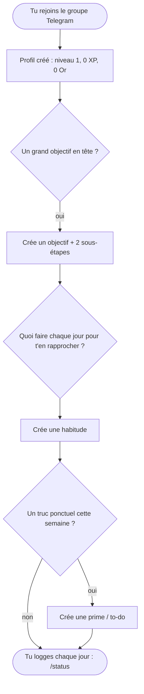

# Démarrer

Configurer ton compte, c'est poser trois choses : un objectif, l'habitude qui t'en rapproche, et tes tâches de la semaine. Cette page te guide pas à pas. Tu peux la suivre seul, sans aide.

## Le parcours en un coup d'œil

On suit ce parcours étape par étape ci-dessous, avec le même exemple du début à la fin : apprendre l'espagnol.

## Étape 0 — Rejoins le groupe

Avant tout, rejoins le groupe Telegram. Ton profil de joueur se crée tout seul à ton premier message : niveau 1, 0 XP, 0 Or. Rien à installer, rien à remplir pour démarrer.

## Étape 1 — Pose un objectif

Demande-toi d'abord : quel grand but je vise ? C'est ton [objectif](#/objectifs).

Crée-le sur l'écran Objectifs, puis découpe-le en **2 sous-étapes**. Une sous-étape, c'est un palier concret que tu pourras vraiment cocher plus tard — pas une intention vague.

> **Exemple.** Objectif : « Apprendre l'espagnol ». Sous-étapes : « finir le module débutant », puis « tenir une conversation de 5 minutes ».

## Étape 2 — Trouve l'action quotidienne

Maintenant, demande-toi : qu'est-ce que je peux faire **chaque jour** pour m'en rapprocher ? Cette action répétée, c'est une [habitude](#/habitudes).

Crée-la avec `/add_habit` (ou sur le site), puis choisis les jours où elle est due. Du coup, elle apparaîtra dans tes quêtes ces jours-là.

> **Exemple.** Pour avancer en espagnol : « Duolingo tous les jours ». C'est une habitude *binaire* — faite ou pas faite, une fois par jour.

## Étape 3 — Ajoute tes tâches de la semaine

Enfin, demande-toi : ai-je un truc ponctuel à faire cette semaine ? Si oui, note-le comme [prime](#/primes-todo) avec `/add todo`.

Une prime, c'est une tâche pour aujourd'hui. La cocher rapporte des stats **et** de l'XP direct. Ça n'a pas besoin d'être lié à ton objectif.

> **Exemple.** « Aller faire les courses ». Rien à voir avec l'espagnol : une prime peut être n'importe quelle tâche concrète du moment.

## Et après ?

Ton compte est prêt. À partir de là, tu logges au fil de la journée. `/status` t'accompagne : il te dit ce qu'il te reste pour réussir ta journée et décrocher un [Perfect Day](#/perfect-day).

Pour le détail de chaque règle et de chaque commande, va voir [Règles & variables](#/regles-et-variables).
