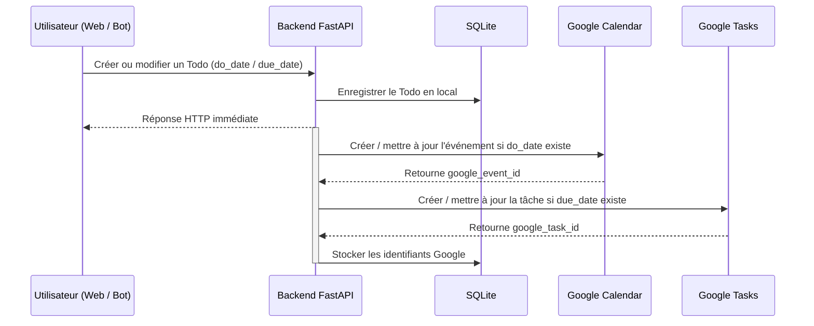

# Brainstorming : Intégration Google Calendar & Habit Tracker (Spécifications Finales)

Ce document valide les spécifications techniques et fonctionnelles actuelles pour
l'intégration de **Google Calendar** et **Google Tasks** dans le Habit Tracker.

---

## 1. Modélisation et mappage des données (Todos)

Un `Todo` dans le Habit Tracker possède deux dates distinctes :

1. **Do Date (date de planification)** : le jour où l'utilisateur prévoit de
   travailler activement sur la tâche.
2. **Due Date (date limite / échéance)** : le jour où la tâche doit être finie.

### Choix d'architecture : hybride

- **Do Date** -> **Google Calendar Event** :
  - Créé comme événement journée entière dans le calendrier dédié
    **Agenda des Quêtes**.
  - Sert à bloquer visuellement le jour de travail dans l'agenda.
  - Titre : `⚔️ <titre>`.
  - Couleur : `colorId=8` (graphite), commune aux todos.
- **Due Date** -> **Google Task** :
  - Créée dans la liste **Habit RPG Tracker**.
  - Sert d'échéance cochable dans Google Tasks.
  - Titre : `🏆 <titre>`.
- **Rappels J-7 / J-3 / J-1** -> **Bot Telegram local** :
  - Les rappels sont basés sur la `do_date`.
  - Le scheduler lance une vérification quotidienne à 09:00, au lieu de créer un
    job APScheduler par todo.

---

## 2. Gestion des rappels Telegram

Chaque jour à 09:00, le bot exécute `check_todo_reminders()` :

1. Il récupère les todos non complétés qui ont une `do_date`.
2. Il calcule l'écart entre aujourd'hui et la `do_date`.
3. Il envoie un rappel Telegram si l'écart est de 7, 3 ou 1 jour.

Le message rappelle la quête planifiée, la date de travail et l'XP promise. Si un
todo est complété ou supprimé avant sa `do_date`, il ne ressort plus dans le scan
quotidien.

---

## 3. Synchronisation automatique des todos

La synchronisation s'effectue en tâche de fond côté FastAPI : l'action locale
répond immédiatement, puis le backend pousse les changements vers Google.

### Règles de synchro

- **Création** :
  - `do_date` présente -> insertion d'un événement Calendar.
  - `due_date` présente -> insertion d'une Google Task.
- **Modification** :
  - `do_date` ajoutée ou modifiée -> création ou `PATCH` de l'événement.
  - `do_date` retirée -> suppression de l'événement et nettoyage de
    `google_event_id`.
  - `due_date` ajoutée ou modifiée -> création ou `PATCH` de la tâche.
  - `due_date` retirée -> suppression de la tâche et nettoyage de
    `google_task_id`.
- **Complétion** :
  - La Google Task liée à la `due_date` passe à `completed`.
  - L'événement Calendar lié à la `do_date` reste en place pour conserver la
    trace du jour de travail.
- **Suppression** :
  - L'événement Calendar et la Google Task associés sont supprimés si leurs IDs
    existent.

---

## 4. Export manuel de l'agenda vertical

La synchronisation de l'agenda vertical est une action manuelle séparée de la
synchro automatique des todos.

Endpoints :

- `POST /api/v1/agenda/export-google` : exporte les quêtes placées sur une plage
  de dates.
- `POST /api/v1/agenda/{date}/export-google-quests` : exporte les quêtes placées
  pour une seule journée.

Règles :

- Seules les quêtes placées dans l'agenda vertical partent vers Google Calendar.
- Les zones biologiques et les segments Perfect Day ne sont pas exportés.
- Chaque événement exporté porte `extendedProperties.private.origin =
  habit-tracker-quest`.
- Avant de réécrire une plage, les anciens événements `habit-tracker-quest` de
  cette plage sont supprimés pour éviter les doublons.
- Les quêtes reprennent l'emoji et la couleur Google de leur type d'effort :
  `musculaire`, `cerveau`, `emotionnel_social`, `creatif_divergent`, ou `repos`.

---

## 5. Flux d'authentification OAuth2

Le serveur tourne sur Raspberry Pi, mais le consentement Google s'ouvre dans le
navigateur de l'utilisateur :

1. Le dashboard appelle `GET /api/v1/auth/google/login`.
2. Le backend construit l'URL OAuth2 avec les scopes Calendar et Tasks.
3. L'utilisateur accepte les accès Google.
4. Google redirige vers `GET /api/v1/auth/google/callback`.
5. Le backend échange le code contre des tokens, crée au besoin le calendrier
   **Agenda des Quêtes** et la liste **Habit RPG Tracker**, puis stocke les IDs.
6. Le `refresh_token` est chiffré avant d'être stocké en SQLite.

`GET /api/v1/auth/google/status` indique si l'utilisateur est connecté.
`POST /api/v1/auth/google/disconnect` efface les tokens et identifiants Google
stockés côté Habit Tracker, sans supprimer les données côté Google.
