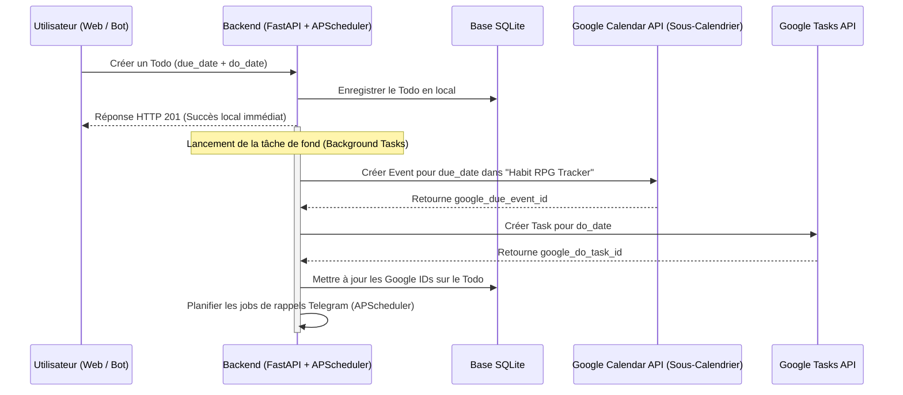

# Brainstorming : Intégration Google Calendar & Habit Tracker (Spécifications Finales)

Ce document valide les spécifications techniques et fonctionnelles pour l'intégration de **Google Calendar** et **Google Tasks** dans le Habit Tracker.

---

## 1. Modélisation et Mappage des Données (Todos)

Un `Todo` dans le Habit Tracker possède deux dates distinctes :
1. **Due Date (Date limite / Date d'échéance)** : Le jour où la tâche doit impérativement être finie.
2. **Do Date (Date de planification)** : Le jour où l'utilisateur prévoit de travailler activement sur la tâche.

### Choix d'Architecture : Option B (Hybride)
*   **Due Date** $\rightarrow$ **Google Calendar Event** (Événement Google Agenda) :
    *   Créé sous forme d'événement "Toute la journée" ou avec heure de fin.
    *   Placé dans le **sous-calendrier dédié "Habit RPG Tracker"**.
*   **Do Date** $\rightarrow$ **Google Task** (Tâche Google Tasks native) :
    *   Créé via l'API Google Tasks. S'affiche visuellement dans le panneau latéral droit de Google Calendar et dans l'app mobile Google Tasks.
*   **Rappels (T-7j, T-3j, T-1j)** $\rightarrow$ **Délégués au Bot Telegram local** :
    *   Puisque l'API Google Tasks ne permet pas de spécifier des rappels fins, le service local d'alertes du Habit Tracker (APScheduler + Telegram Bot listener) s'occupe de notifier Gabriel aux échéances configurées.

---

## 2. Gestion Détaillée des Rappels (Telegram Bot + APScheduler)

Chaque fois qu'un `Todo` est créé ou modifié avec une `do_date` valide :

1.  **Génération des Jobs de Rappel** :
    *   Le backend calcule trois dates d'envoi :
        *   **Rappel 1 semaine** : `do_date - 7 jours` à 09:00.
        *   **Rappel 3 jours** : `do_date - 3 jours` à 09:00.
        *   **Rappel 1 jour** : `do_date - 1 jour` à 09:00.
    *   Ces tâches planifiées sont insérées dans **APScheduler** avec un identifiant unique (ex: `todo_reminder_1w_{todo_id}`).

2.  **Notification Telegram** :
    *   À l'exécution du job, le bot Telegram envoie un message formaté :
        > 🔔 **Rappel Quête / Tâche** :
        > **[Titre de la tâche]** est planifiée pour le **[do_date]**.
        > *Il vous reste X jours pour vous y préparer.*
        > 
        > [Accéder au Dashboard] | [Marquer Terminé]

3.  **Gestion des Mises à Jour (Cycle de Vie)** :
    *   **Si la `do_date` change** : Les anciens jobs de rappel dans APScheduler sont annulés et reprogrammés.
    *   **Si le Todo est complété ou supprimé** : Les jobs restants sont immédiatement retirés d'APScheduler.

---

## 3. Synchronisation Automatique des Todos

La synchronisation s'effectue en tâche de fond (asynchrone) dans FastAPI.

### Règles de Synchro :
*   **Création** : Appels asynchrones Google Calendar (insert) + Google Tasks (insert). Stockage des Google IDs.
*   **Modification** :
    *   Si modification du titre ou de la `due_date` : mise à jour de l'événement dans le calendrier "Habit RPG Tracker".
    *   Si modification de la `do_date` : mise à jour dans Google Tasks + mise à jour des rappels locaux.
*   **Complétion (Automatique dans Google)** :
    *   Quand le Todo est validé dans le Habit Tracker :
        1.  **Google Tasks (Do Date)** : Passage du statut à `"completed"` pour valider la tâche dans l'interface Google.
        2.  **Google Calendar (Due Date)** : L'événement d'échéance dans le calendrier "Habit RPG Tracker" est conservé et mis à jour en préfixant son titre par `✅ [Terminé] ` pour garder l'historique visuel propre (ex: `✅ [Terminé] Rédiger le rapport`).
*   **Suppression** :
    *   Appels `DELETE` sur l'événement Google Calendar et la tâche Google Tasks.
    *   Retrait des jobs de rappel dans APScheduler.

---

## 4. Synchronisation Manuelle de la "Journée Type" (Chronologie)

La synchronisation de la **Chronologie de la Journée Type** (Sleep, Rest, Admin, Intense) est une action manuelle.

### Intégration UI & Backend
1.  Un bouton **"Exporter vers Google Agenda"** est placé dans l'onglet *Perfect Day*.
2.  Une fenêtre permet de sélectionner la plage de dates cible (ex: aujourd'hui, demain, ou les 7 prochains jours).
3.  Pour chaque journée de la période :
    *   Le backend lit la disposition des blocs locaux (`Sleep`, `Rest`, `Admin`, `Intense`).
    *   Il crée les événements correspondants dans le sous-calendrier **"Habit RPG Tracker"** pour ne pas polluer l'agenda principal de l'utilisateur.
    *   **Idempotence** : Chaque événement créé reçoit un tag (`extendedProperties.private.origin = "habit-tracker-timeline"`). Avant d'écrire, le backend supprime les anciens blocs exportés pour cette journée afin de pouvoir ré-exporter à volonté sans doublons.

---

## 5. Flux d'Authentification OAuth2 (Raspberry Pi Headless)

Puisque le serveur tourne sur un Raspberry Pi sans navigateur local :
1.  Gabriel configure son `client_id` et `client_secret` Google dans le fichier `.env` du Pi.
2.  Dans l'interface Web du Habit Tracker (Paramètres), Gabriel clique sur **"Connecter mon compte Google"**.
3.  Le backend renvoie l'URL de connexion Google. Gabriel valide les accès (scopes `calendar` et `tasks`).
4.  Google le redirige vers l'adresse publique/locale du Pi (ex: `http://localhost:5000/api/v1/auth/google/callback`).
5.  Le backend crée automatiquement le sous-calendrier **"Habit RPG Tracker"** s'il n'existe pas encore.
6.  Le backend récupère le `refresh_token`, le chiffre, et le stocke dans SQLite pour permettre les synchronisations futures en arrière-plan.
