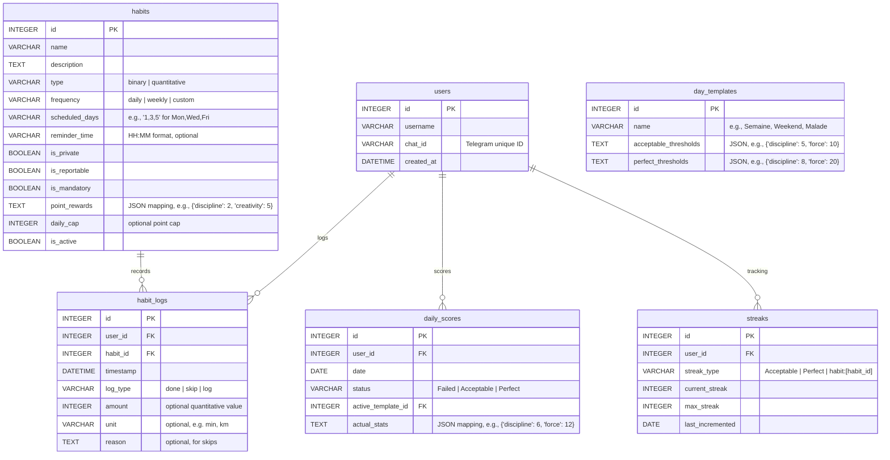

# Database Schema & Data Model: habit-tracker-bot

This document defines the SQLite data model and schema relationships for the habit tracker.

## Schema Details & Constraints

### 1. `users` Table
- Stores participants. In V1 solo-mode, there is exactly one user row (e.g. username `Gabriel`), but the schema fully supports multi-user tracking (V2 ready).
- `chat_id`: Unique index to look up users by their incoming Telegram messaging ID.

### 2. `habits` Table
- `type`: Must be strictly `binary` (yes/no) or `quantitative` (measurable duration or quantity).
- `point_rewards`: Stores a JSON dictionary mapping the 12 general stats to specific awarded values (e.g., `{"creativity": 5, "discipline": 2}`).
- `scheduled_days`: Comma-separated integers `0` (Sunday) to `6` (Saturday) indicating when the habit is expected.

### 3. `habit_logs` Table
- `log_type`: Restricted to `done` (completed habit), `skip` (excused failure with reason), or `log` (quantitative logging).
- `amount` and `unit`: Required for quantitative logs (e.g., amount `30` and unit `min` for `/log lecture 30min`).
- Integrity: Cascade deletes on user or habit deletion.

### 4. `day_templates` Table
- Defaults:
  - ID 1: `Semaine` (default Mon-Fri)
  - ID 2: `Weekend` (default Sat-Sun)
  - ID 3: `Récupération` (manual switch)
  - ID 4: `Malade` (manual switch)
- `acceptable_thresholds` / `perfect_thresholds`: JSON mapping of stats needed to validate a day (e.g., `{"discipline": 5}`).

### 5. `daily_scores` Table
- Evaluated daily at 23:59 via database scheduler.
- Computes daily points across the 12 stats based on the logs for that date, applying daily caps.
- Compares computed totals against the `acceptable_thresholds` and `perfect_thresholds` of the currently active day template.

### 6. `streaks` Table
- `streak_type`: Can track the overall `Acceptable` streak, the `Perfect` streak, or individual habit streaks.
- `last_incremented`: Keeps track of date of last update to prevent double-increments on the same calendar day and manage streak breaking.
