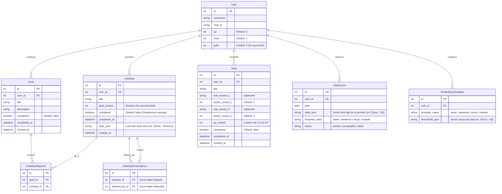

# Plan d'Architecture & Migration — Progression Réelle & RPG V2 📐🛠️

Ce document décrit la structure technique de la base de données, des API et des flux de travail pour l'implémentation de la V2.

---

## 💾 1. Modèles & Schéma SQLite (Graph & Ephemeral)

Pour supporter le graphe multiniveau d'objectifs, l'économie de l'or, les statistiques éphémères et les 4 templates, le schéma relationnel SQLite est conçu comme suit :



### Script de Migration SQL (`backend/src/database/migrations/v2_rebuilt.sql`)
Ce script initialisera les nouvelles tables et migrera les structures de la V1 :
```sql
-- Création des tables de progression par objectifs & graphes
CREATE TABLE goals (
    id INTEGER PRIMARY KEY AUTOINCREMENT,
    user_id INTEGER NOT NULL,
    title TEXT NOT NULL,
    description TEXT,
    completed BOOLEAN DEFAULT 0,
    completed_at DATETIME,
    created_at DATETIME DEFAULT CURRENT_TIMESTAMP,
    FOREIGN KEY(user_id) REFERENCES users(id)
);

CREATE TABLE substeps (
    id INTEGER PRIMARY KEY AUTOINCREMENT,
    user_id INTEGER NOT NULL,
    title TEXT NOT NULL,
    gold_reward INTEGER DEFAULT 0,
    completed BOOLEAN DEFAULT 0,
    completed_at DATETIME,
    stats_json TEXT, -- JSON array of strings
    created_at DATETIME DEFAULT CURRENT_TIMESTAMP,
    FOREIGN KEY(user_id) REFERENCES users(id)
);

CREATE TABLE goal_substep_links (
    id INTEGER PRIMARY KEY AUTOINCREMENT,
    goal_id INTEGER NOT NULL,
    substep_id INTEGER NOT NULL,
    FOREIGN KEY(goal_id) REFERENCES goals(id) ON DELETE CASCADE,
    FOREIGN KEY(substep_id) REFERENCES substeps(id) ON DELETE CASCADE
);

CREATE TABLE substep_dependencies (
    id INTEGER PRIMARY KEY AUTOINCREMENT,
    substep_id INTEGER NOT NULL,
    blocked_by_id INTEGER NOT NULL,
    FOREIGN KEY(substep_id) REFERENCES substeps(id) ON DELETE CASCADE,
    FOREIGN KEY(blocked_by_id) REFERENCES substeps(id) ON DELETE CASCADE
);

-- Table des Templates de Perfect Day
CREATE TABLE perfect_day_templates (
    id INTEGER PRIMARY KEY AUTOINCREMENT,
    user_id INTEGER NOT NULL,
    template_name TEXT NOT NULL, -- 'week', 'weekend', 'recup', 'malade'
    thresholds_json TEXT NOT NULL, -- JSON object, e.g. {"force": 16, "mobilité": 4}
    FOREIGN KEY(user_id) REFERENCES users(id)
);

-- Mise à jour de la table User pour stocker l'XP, les niveaux et l'or accumulé
ALTER TABLE users ADD COLUMN xp INTEGER DEFAULT 0;
ALTER TABLE users ADD COLUMN level INTEGER DEFAULT 1;
ALTER TABLE users ADD COLUMN gold INTEGER DEFAULT 0;
```

---

## 🚀 2. Endpoints de l'API REST (FastAPI)

Les endpoints REST seront partitionnés par utilisateur via `?user_id=X` :

### Gestion des Objectifs (Graphes)
- `GET /api/v1/goals` : Renvoie la liste de tous les objectifs de l'utilisateur avec leurs sous-étapes associées.
- `POST /api/v1/goals` : Crée un nouvel objectif majeur.
- `POST /api/v1/goals/{goal_id}/substeps` : Crée une nouvelle sous-étape et l'associe à l'objectif.
- `POST /api/v1/substeps/link` : Lie une sous-étape existante à un autre objectif (liaison partagée).
- `POST /api/v1/substeps/{substep_id}/dependency` : Déclare une relation de dépendance bloquante entre deux sous-étapes.
- `POST /api/v1/substeps/{substep_id}/complete` : Coche manuellement une sous-étape.
  - **Règle** : Renvoie une erreur `400 Bad Request` si une sous-étape bloquante n'est pas encore validée.
  - **Effet** : Marque la sous-étape comme validée partout, attribue l'Or personnalisé à l'utilisateur.

### Gestion du Grimoire & Perfect Day Settings
- `GET /api/v1/templates` : Renvoie la configuration des 4 templates.
- `POST /api/v1/templates` : Enregistre les seuils de statistiques pour un template.
- `GET /api/v1/quests/daily-stats-potentials` : Calcule et renvoie la somme théorique des statistiques par jour de la semaine en fonction des habitudes programmées, triées du lundi au dimanche.

---

## 🤖 3. Commandes & Logique Telegram Bot

Le bot Telegram (`backend/src/bot/`) exécutera les flux suivants :

1. **Log d'Habitudes** (`/log <habit_key> <value>`) :
   - Ajoute la valeur aux statistiques quotidiennes de l'utilisateur dans l'état éphémère en base de données.
2. **Choix du Template** (`/template <recup|malade|week|weekend>`) :
   - Modifie le template de la journée en cours.
3. **Statut Courant** (`/status`) :
   - Calcule l'état éphémère du jour et le compare au template actif pour afficher la progression sous forme de barre de points.
4. **Calcul de Minuit (Cron de fin de journée)** :
   - Détermine dynamiquement si c'est Semaine (Lun-Ven) ou Weekend (Sam-Dim) si aucun template manuel n'est appliqué.
   - Compare les scores de la journée aux objectifs du template choisi.
   - Si les objectifs sont atteints ➔ **Perfect Day !** ➔ Attribue **5 XP** permanents.
   - Gère le passage de niveau exponentiel :
     $$\text{XP Requis}(L) = 10 \times 2^{L-1}$$
   - Fige la journée dans `DailyScore` pour le calendrier historique de 30 jours.
   - **Mise à 0** de toutes les statistiques quotidiennes éphémères de la feuille de personnage pour le lendemain.
   - Envoie le bulletin de victoire/défaite par Telegram.

---

## 🧪 4. Plan de Tests & Vérifications

### Tests Automatisés
- `tests/test_goals_graph.py` :
  - Valide la création de sous-étapes multiniveaux et de liaisons de graphes.
  - Teste la complétion partagée (cocher dans un objectif coche dans l'autre).
  - Teste l'interdiction stricte de cocher une sous-étape bloquée (dépendance non résolue).
- `tests/test_ephemeral_stats.py` :
  - Valide que les statistiques cumulées des habitudes et Todos reviennent bien à 0 après le calcul de fin de journée.
  - Valide l'attribution de 5 XP par Perfect Day et la formule de montée de niveau exponentielle.

### Vérification Visuelle
- Utilisation de scripts de validation pour générer des objectifs et des sous-étapes complexes et tester leur rendu sur les 3 écrans du localhost dashboard.
