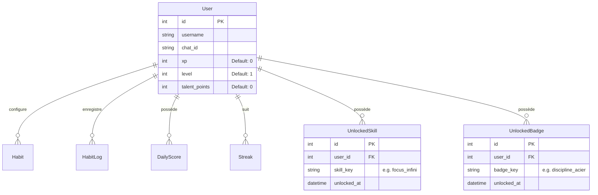

# Plan d'Architecture & Migration — RPG Multi-User V2 🛠️📐

Ce document fournit le plan technique et architectural pour implémenter les fonctionnalités de la **V2** sans casser l'existant (rétrocompatibilité de la V1).

---

## 💾 1. Migrations & Schéma SQLite

Pour supporter le multi-utilisateur et l'arbre de compétences, nous devons enrichir notre schéma relationnel avec les champs suivants :



### Script de Migration SQL
Un script `backend/src/database/migrations/v2_migration.sql` ajoutera les colonnes et créera les tables associées :
```sql
-- Ajout des colonnes de progression RPG à la table existante
ALTER TABLE users ADD COLUMN xp INTEGER DEFAULT 0;
ALTER TABLE users ADD COLUMN level INTEGER DEFAULT 1;
ALTER TABLE users ADD COLUMN talent_points INTEGER DEFAULT 0;

-- Table de liaison pour les compétences débloquées
CREATE TABLE user_unlocked_skills (
    id INTEGER PRIMARY KEY AUTOINCREMENT,
    user_id INTEGER NOT NULL,
    skill_key TEXT NOT NULL,
    unlocked_at DATETIME DEFAULT CURRENT_TIMESTAMP,
    FOREIGN KEY(user_id) REFERENCES users(id)
);

-- Table de liaison pour les badges décernés
CREATE TABLE user_unlocked_badges (
    id INTEGER PRIMARY KEY AUTOINCREMENT,
    user_id INTEGER NOT NULL,
    badge_key TEXT NOT NULL,
    unlocked_at DATETIME DEFAULT CURRENT_TIMESTAMP,
    FOREIGN KEY(user_id) REFERENCES users(id)
);
```

---

## 👥 2. Routage Multi-User & Authentification Bot

### Identification automatique sur Telegram
Le listener intercepte l'expéditeur de chaque commande :
```python
user_username = update.message.from_user.username or update.message.from_user.first_name
chat_id = str(update.message.chat_id)

# Résolution en base de données
user = db.query(User).filter_by(username=user_username).first()
if not user:
    user = User(username=user_username, chat_id=chat_id, xp=0, level=1, talent_points=0)
    db.add(user)
    db.commit()
```

### API Dashboard sécurisée
Pour éviter qu'un utilisateur ne modifie les quêtes d'un autre :
1. **Endpoint `GET /api/v1/users`** : Renvoie les profils actifs.
2. **Session Header / Query Parameter `?user_id=X`** : Le dashboard transmet l'identifiant de l'utilisateur actif à chaque requête, et les endpoints REST filtrent les résultats en conséquence (`user_id = int(request.query_params.get("user_id", 1))`).

---

## 🧪 3. Implémentation du Moteur RPG (XP & Talent Multipliers)

Dans `backend/src/services/score_service.py`, la fonction de logging intègre le calcul passif des multiplicateurs :

```python
def process_habit_log(db: Session, user_id: int, habit_id: int, ...):
    # 1. Vérifier si l'utilisateur possède la compétence "Focus Infini"
    has_focus = db.query(UnlockedSkill).filter_by(user_id=user_id, skill_key="focus_infini").first()
    
    # 2. Appliquer les gains de points
    multiplier = 1.15 if (has_focus and stat == "discipline") else 1.0
    adjusted_points = raw_points * multiplier
    
    # 3. Attribuer l'XP (1 XP par point accordé)
    user = db.query(User).filter_by(id=user_id).first()
    user.xp += int(adjusted_points)
    
    # 4. Vérifier la montée de niveau
    next_level_xp = int((user.level) ** 1.8 * 100)
    if user.xp >= next_level_xp:
        user.level += 1
        user.talent_points += 1
        # Déclencher une notification
```

---

## 📋 4. Plan de Tests & Vérifications

### Tests Unitaires
- `tests/test_rpg_engine.py` : Valide la formule mathématique d'XP, la montée de niveau automatique, et l'accumulation des points de talents.
- `tests/test_skills.py` : Valide l'application stricte des multiplicateurs de compétences (Focus Infini, Savoir Ancestral) lors des check-ins.

### Tests d'Intégration Multi-User
- `tests/test_multiuser_concurrency.py` : Valide que Jeanne et Gabriel peuvent logguer des habitudes différentes en parallèle sur le même SQLite sans interférences de scores ni de verrous SQL.

---

## 📝 5. Table des Todos (Bounties) & Logique Grimoire

### Modèle SQLAlchemy `Todo`
```python
class Todo(Base):
    __tablename__ = "todos"
    
    id = Column(Integer, primary_key=True, index=True)
    user_id = Column(Integer, ForeignKey("users.id"), nullable=False)
    title = Column(String, nullable=False)
    description = Column(String, nullable=True)
    stat_reward = Column(String, nullable=False) # e.g., "discipline", "organisation"
    points_reward = Column(Integer, default=3)
    xp_reward = Column(Integer, default=50)
    completed = Column(Boolean, default=False)
    completed_at = Column(DateTime, nullable=True)
    created_at = Column(DateTime, default=datetime.datetime.utcnow)
```

### Logique du Grimoire du Jour Parfait
Le Grimoire compare en direct les points cumulés de la journée (habitudes + todos complétés) avec les seuils requis par le template actif :
```python
def check_grimoire_targets(db: Session, user_id: int, date: datetime.date):
    # 1. Récupérer le score journalier (contient le template actif)
    score = db.query(DailyScore).filter_by(user_id=user_id, date=date).first()
    if not score:
        return []
    
    # 2. Récupérer les seuils requis pour ce template
    thresholds = score.template.thresholds
    
    # 3. Récupérer les points cumulés aujourd'hui (habitudes + todos)
    earned_points = get_today_earned_stats(db, user_id, date)
    
    # 4. Comparer et renvoyer la liste de progression
    targets = []
    for t in thresholds:
        current = earned_points.get(t.stat_name.lower(), 0.0)
        targets.append({
            "stat": t.stat_name,
            "current": current,
            "acceptable": t.acceptable_threshold,
            "perfect": t.perfect_threshold,
            "satisfied": current >= t.perfect_threshold
        })
    return targets
```

